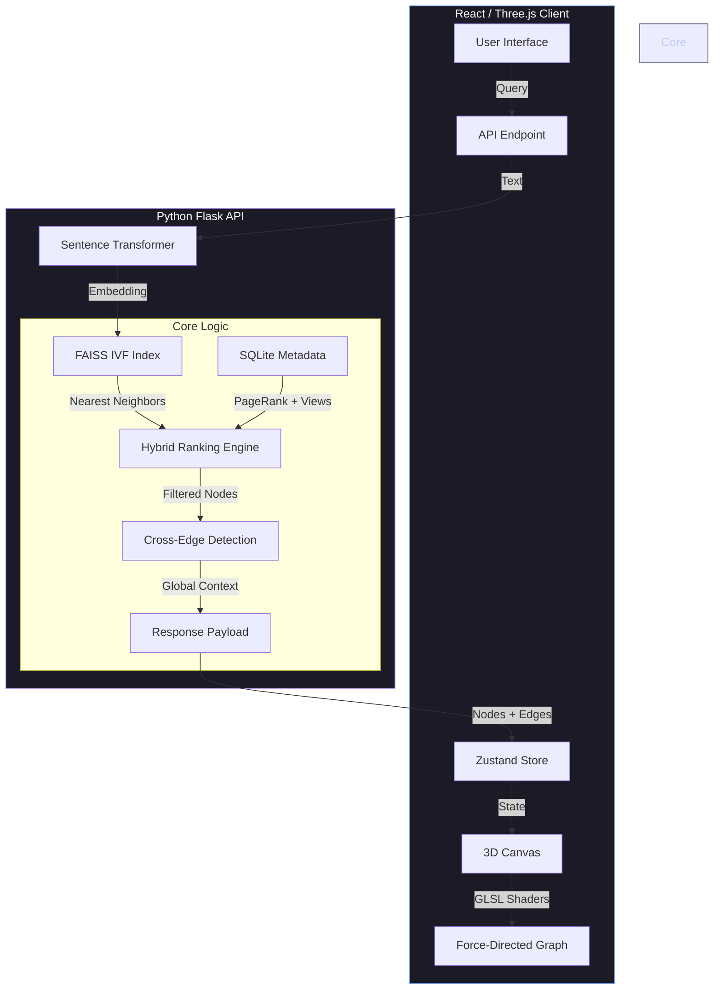

<div align="center">
  
  <h1>wikiExplorer</h1>
  <p><strong>3D Semantic Knowledge Graph Navigator</strong></p>
  
  <p>
    
    
    
    
  </p>
</div>

---

### 🌐 The Concept
**wikiExplorer** moves beyond linear encyclopedias. It transforms the English Wikipedia into an interactive, 3D force-directed galaxy. By leveraging **384-dimensional vector embeddings** (MiniLM-L6-v2), it discovers hidden connections between topics that traditional keyword searches miss, rendering them in a high-performance WebGL environment.

---

### 🛠️ System Architecture



---

### 🧪 Core Features

#### 1. Hybrid Search & Ranking
We don't just return the most similar words. Results are ranked via a weighted geometric mean of four signals:
* **Semantic Similarity (50%):** Vector distance via `all-MiniLM-L6-v2`.
* **PageRank (40%):** Node centrality within the full Wikipedia graph.
* **Pageviews (5%):** Popularity metrics to filter obscure trivia.
* **Title Match (5%):** Exact string matching bias.

#### 2. Context-Aware Cross-Edges
Unlike standard trees, wikiExplorer calculates **global cross-edges**. When a new node is expanded, the backend scans the *entire existing graph* to find semantic connections between the new node and previously explored nodes, creating a true mesh network rather than a simple hierarchy.

#### 3. High-Performance Visualization
* **Custom Shaders:** Nodes feature Fresnel glow effects; edges use animated GLSL particle mist that shimmers based on connection strength.
* **Dynamic LOD:** Automatically toggles between high-fidelity visuals and performant geometry based on hardware capabilities.
* **Instancing:** Capable of rendering thousands of nodes at 60FPS using `react-force-graph-3d`.

#### 4. Persistence
* **Session Management:** Save and load entire graph states to JSON.
* **Smart Caching:** The frontend implements a `LinkCacheService` that prefetches expansion candidates, allowing instant node expansions after the initial load.

---

### bsd Directory Structure

| Path | Description |
| :--- | :--- |
| `backend/core/search_engine.py` | FAISS index management & vector encoding. |
| `backend/core/ranking.py` | Multi-signal scoring logic (PageRank/Views/Semantic). |
| `backend/core/cross_edges.py` | Logic for finding links between sibling nodes. |
| `frontend/src/components/GraphCanvas.tsx` | Main Three.js renderer & physics engine. |
| `frontend/src/components/graph/MistEffect.ts` | Custom GLSL shader for particle-flow edges. |
| `data/` | *[GitIgnored]* Contains the `.faiss` index and `.db` metadata. |

---

### 🚀 Quick Start

**Backend:**
```bash
cd backend
python -m venv venv && source venv/bin/activate
pip install -r reqs.txt
# Ensure index.faiss and metadata.db are in /data
python app.py
```

**Frontend:**
```bash
cd frontend
npm install
npm run dev
```
