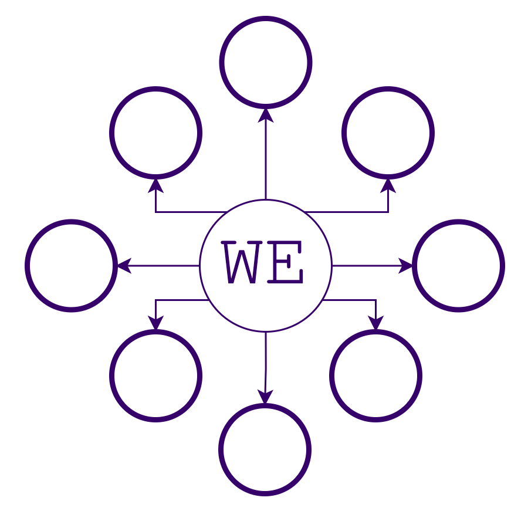

# wikiExplorer

Interactive 3D knowledge graph for exploring Wikipedia through semantic search.

<p align="center">
  
</p>

## Stack

**Backend:** Python Flask, FAISS vector search, Sentence Transformers (MiniLM-L6-v2), SQLite metadata, PostgreSQL analytics

**Frontend:** React/TypeScript, Three.js, react-force-graph-3d, Zustand state, TailwindCSS

## Architecture

### Backend (Flask API)
- `core/search_engine.py` - FAISS index + sentence transformer embeddings
- `core/ranking.py` - Multi-signal scoring (semantic 50%, PageRank 40%, pageviews 5%, title match 5%)
- `core/cross_edges.py` - Semantic similarity between existing nodes (0.65 threshold)
- `routes/search_routes.py` - `/api/related/<title>` endpoint with context-aware expansion
- `models/` - SQLAlchemy ORM for search history tracking

### Frontend (React/Three.js)
- `components/graph/NodeRenderer.ts` - Dynamic node styling by depth and importance
- `components/graph/MistEffect.ts` - Shader-based particle effects for edges
- `stores/graphStore.ts` - Zustand state with save/load graph functionality
- `hooks/useArticleLoader.ts` - Initial search + first 7 results display
- `hooks/useNodeExpander.ts` - Progressive expansion with client-side cache
- `services/linkCache.ts` - Prefetch 42 links per node for instant expansion

## Key Features

**Semantic Search:** 384-dim vector embeddings with FAISS IVF index for sub-100ms queries

**Smart Ranking:** Geometric mean of semantic similarity, Wikipedia PageRank, monthly pageviews, and exact title matching

**Cross-Edge Detection:** Automatically discovers semantic connections between nodes already in graph

**Efficient Expansion:** Fetches 49 links per query, displays 7, caches 42 for O(1) subsequent expansions

**Depth Visualization:** Color gradient from purple (root) through blue/cyan/teal to green (depth 6+)

**Graph Persistence:** Export/import complete exploration sessions as JSON

## Setup

### Backend
```bash
cd backend
python -m venv venv && source venv/bin/activate
pip install -r reqs.txt
# Place index.faiss and metadata.db in data/
# Set DATABASE_URL in .env
python app.py  # Runs on :5001
```

### Frontend
```bash
cd frontend
npm install
# Set VITE_API_URL=http://localhost:5001 in .env
npm run dev  # Runs on :5173
```

## Data Requirements

**FAISS Index:** `data/index.faiss` - IVF structure with 384-dim vectors

**Metadata DB:** `data/metadata.db` with schema:
- article_id (INTEGER PRIMARY KEY)
- title, lookup_title (TEXT)
- pagerank (REAL)
- pageviews, backlinks (INTEGER)

## API

**GET /api/related/{title}** - Fetch related articles
- `k` - Results to return (default 32)
- `context` - Comma-separated existing node IDs for cross-edge detection
- `ranking` - "default" or "semantic_only"
- `private` - Skip analytics tracking

**GET /api/health** - Index stats, signal coverage, configuration

## Implementation Notes

**Force Layout:** 3D force-directed graph with distance inversely proportional to similarity score (40-300 units)

**Node Rendering:** Custom Three.js objects with wireframe sphere, shader glow, and canvas text sprite

**Edge Effects:** GLSL shader particles flowing between nodes with time-based shimmer

**Mobile Support:** Reduced particle count (150 vs 300), simplified controls, responsive UI
